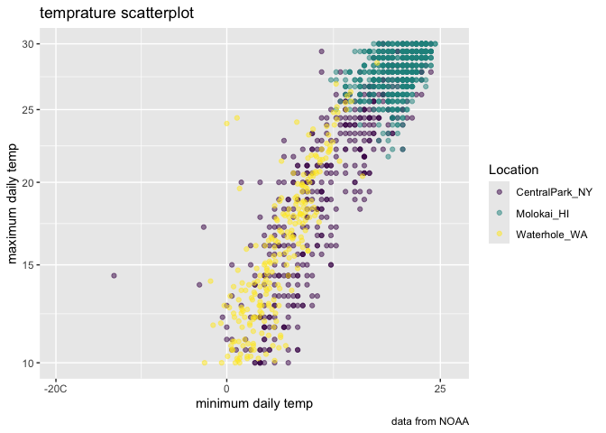

vis_2
================
yz5248
2025-09-30

import the weather data

``` r
data("weather_df")
```

``` r
weather_df |> 
  #filter(tmin>10, tmax>30) |>
  ggplot(aes(x = tmin, y = tmax)) + 
  geom_point(aes(color = name), alpha = .5) +
  labs(
    x = "minimum daily temp",
    y = "maximum daily temp",
    title = "temprature scatterplot",
    caption = "data from NOAA",
    color = "location"
  ) +
  scale_x_continuous(
    breaks = c(-20, 0, 25),
    labels = c("-20C", "0", "25")
  ) + 
  scale_y_continuous(
    trans = "sqrt",
    limits = c(10, 30)
  ) + 
  viridis::scale_color_viridis(
    name = "Location", 
    discrete = TRUE
  )
```

    ## Warning in transformation$transform(x): NaNs produced

    ## Warning in scale_y_continuous(trans = "sqrt", limits = c(10, 30)): sqrt
    ## transformation introduced infinite values.

    ## Warning: Removed 843 rows containing missing values or values outside the scale range
    ## (`geom_point()`).

<!-- -->
