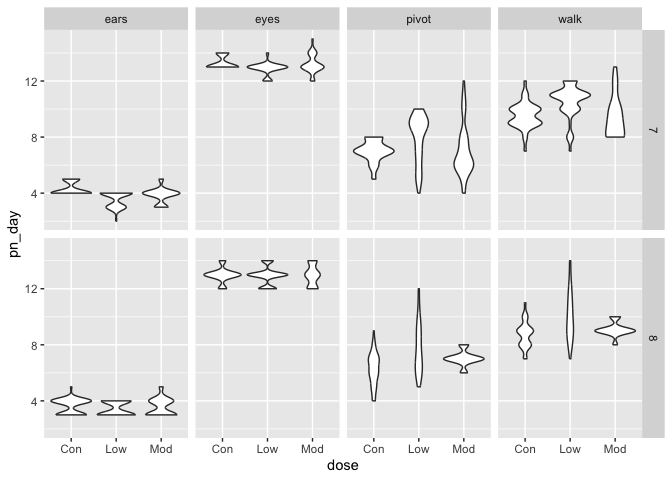

vis_2
================
yz5248
2025-09-30

import the weather data

``` r
data("weather_df")
```

``` r
ggp_temperature =
weather_df |> 
  #filter(tmin>10, tmax>30) |>
  ggplot(aes(x = tmin, y = tmax)) + 
  geom_point(aes(color = name), alpha = 0.5) +
  labs(
    x = "minimum daily temp",
    y = "maximum daily temp",
    title = "temprature scatterplot",
    caption = "data from NOAA",
    color = "location"
  ) +
  scale_x_continuous(
    breaks = c(-20, 0, 25),
    labels = c("-20C", "0", "25")
  ) + 
  scale_y_continuous(
    trans = "sqrt",
    limits = c(10, 30)
  ) + 
  viridis::scale_color_viridis(
    name = "Location", 
    discrete = TRUE
  )
```

update basic plot

``` r
ggp_temperature + 
  theme_minimal() +
  theme(legend.position = "bottom")
```

    ## Warning in transformation$transform(x): NaNs produced

    ## Warning in scale_y_continuous(trans = "sqrt", limits = c(10, 30)): sqrt
    ## transformation introduced infinite values.

    ## Warning: Removed 843 rows containing missing values or values outside the scale range
    ## (`geom_point()`).

<!-- -->

\#adding data in geoms

``` r
central_park_df = 
  weather_df |> 
  filter(name == "CentralPark_NY")

molokai_df = 
  weather_df |> 
  filter(name == "Molokai_HI")

ggplot(data = molokai_df, aes(x = date, y = tmax, color = name)) + 
  geom_point() + 
  geom_line(data = central_park_df) 
```

    ## Warning: Removed 1 row containing missing values or values outside the scale range
    ## (`geom_point()`).

<!-- -->

\#patchwork combine these works

``` r
ggp_tmax_tmin = 
  weather_df |>
  ggplot(aes(x = tmin, y = tmax, color = name)) +
  geom_point(alpha = 0.5) +
  theme(legend.position = "none")

ggp_prcp_density = 
  weather_df |> 
  filter(prcp > 0) |> 
  ggplot(aes(x = prcp, fill = name)) + 
  geom_density(alpha = .5) +
  theme(legend.position = "none")

ggp_temp_season = 
  weather_df |> 
  ggplot(aes(x = date, y = tmax, color = name)) + 
  geom_point(alpha = .5) +
  geom_smooth(se = FALSE) +
  theme(legend.position = "bottom")

(ggp_tmax_tmin + ggp_prcp_density) / ggp_temp_season
```

    ## Warning: Removed 17 rows containing missing values or values outside the scale range
    ## (`geom_point()`).

    ## `geom_smooth()` using method = 'loess' and formula = 'y ~ x'

    ## Warning: Removed 17 rows containing non-finite outside the scale range
    ## (`stat_smooth()`).
    ## Removed 17 rows containing missing values or values outside the scale range
    ## (`geom_point()`).

<!-- -->

\#data manipulation

``` r
weather_df |>
  mutate(name = fct_relevel(name, c("Molokai_HI", "CentralPark_NY", "Waterhole_WA"))) |> 
  ggplot(aes(x = name, y = tmax, fill = name)) +
  geom_violin(alpha = 0.5)
```

    ## Warning: Removed 17 rows containing non-finite outside the scale range
    ## (`stat_ydensity()`).

<!-- -->

``` r
weather_df |>
  mutate(name = fct_reorder(name, tmax)) |> 
  ggplot(aes(x = name, y = tmax, fill = name)) +
  geom_violin(alpha = 0.5)
```

    ## Warning: There was 1 warning in `mutate()`.
    ## ℹ In argument: `name = fct_reorder(name, tmax)`.
    ## Caused by warning:
    ## ! `fct_reorder()` removing 17 missing values.
    ## ℹ Use `.na_rm = TRUE` to silence this message.
    ## ℹ Use `.na_rm = FALSE` to preserve NAs.

    ## Warning: Removed 17 rows containing non-finite outside the scale range
    ## (`stat_ydensity()`).

<!-- -->

``` r
  theme(legend.position = "bottom")
```

    ## <theme> List of 1
    ##  $ legend.position: chr "bottom"
    ##  @ complete: logi FALSE
    ##  @ validate: logi TRUE

what about tidiness

``` r
pulse_df = 
  haven::read_sas("data_import_examples/public_pulse_data.sas7bdat") |>
  janitor::clean_names() |>
  pivot_longer(
    bdi_score_bl:bdi_score_12m,
    names_to = "visit", 
    values_to = "bdi"
  ) |>
  mutate(visit = fct_inorder((visit)))

pulse_df |>
  ggplot(aes(x = visit, y = bdi)) + 
  geom_boxplot()
```

    ## Warning: Removed 879 rows containing non-finite outside the scale range
    ## (`stat_boxplot()`).

<!-- -->

make a plot for FAS study

``` r
pups_df = 
  read_csv("data_import_examples/FAS_pups.csv", na = c("NA", ".", ""), skip = 3) |>
  janitor::clean_names() |>
  mutate(
    sex = case_match(
      sex,
      1 ~ "male",
      2 ~ "female"
    )
  )
```

    ## Rows: 313 Columns: 6
    ## ── Column specification ────────────────────────────────────────────────────────
    ## Delimiter: ","
    ## chr (1): Litter Number
    ## dbl (5): Sex, PD ears, PD eyes, PD pivot, PD walk
    ## 
    ## ℹ Use `spec()` to retrieve the full column specification for this data.
    ## ℹ Specify the column types or set `show_col_types = FALSE` to quiet this message.

``` r
litters_df =
  read_csv("data_import_examples/FAS_litters.csv", na = c("NA", ".", "")) |>
  janitor::clean_names() |>
  separate(group, into = c("dose", "tx_day"), sep = 3)
```

    ## Rows: 49 Columns: 8
    ## ── Column specification ────────────────────────────────────────────────────────
    ## Delimiter: ","
    ## chr (2): Group, Litter Number
    ## dbl (6): GD0 weight, GD18 weight, GD of Birth, Pups born alive, Pups dead @ ...
    ## 
    ## ℹ Use `spec()` to retrieve the full column specification for this data.
    ## ℹ Specify the column types or set `show_col_types = FALSE` to quiet this message.

``` r
fas_df = 
  left_join(pups_df, litters_df, by = "litter_number")

fas_df |>
  select(pd_ears:tx_day) |>
  pivot_longer(
    pd_ears:pd_walk,
    names_to = "outcome",
    names_prefix = "pd_",
    values_to = "pn_day"
  ) |>
  drop_na() |>
  ggplot(aes(x = dose, y = pn_day)) +
  geom_violin() +
  facet_grid(tx_day~outcome)
```

<!-- -->
